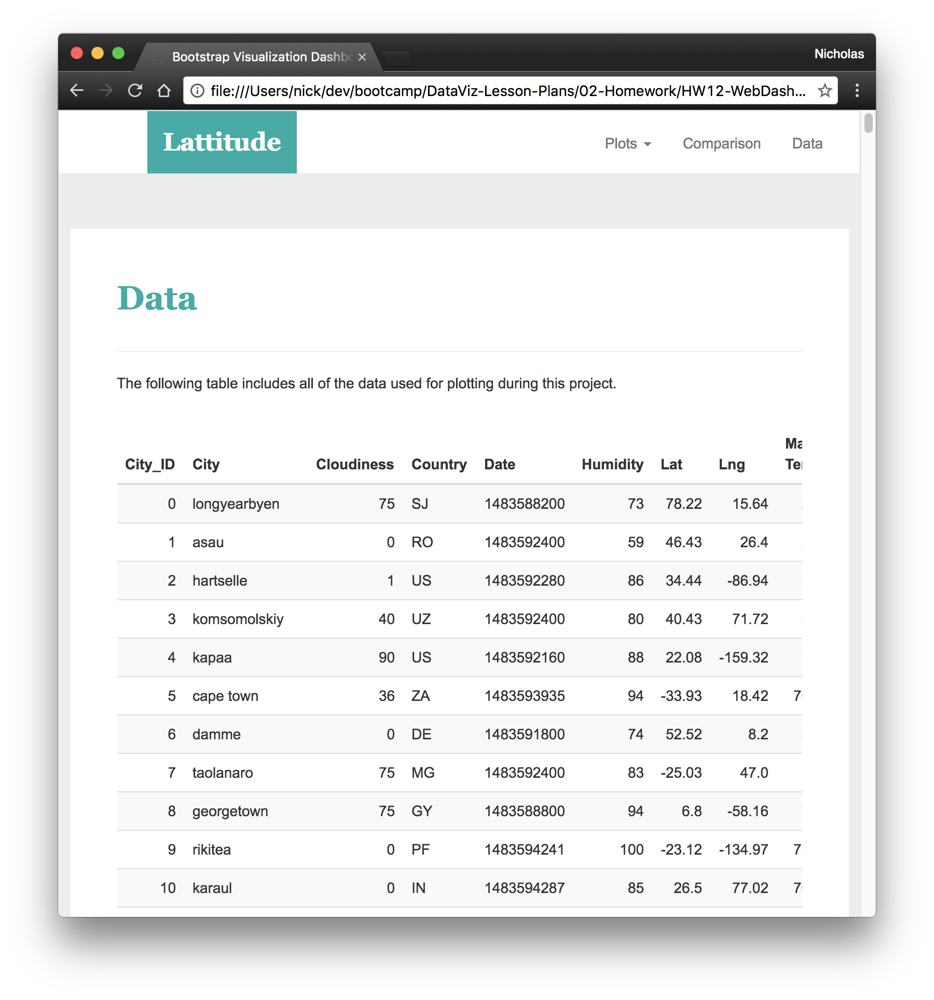
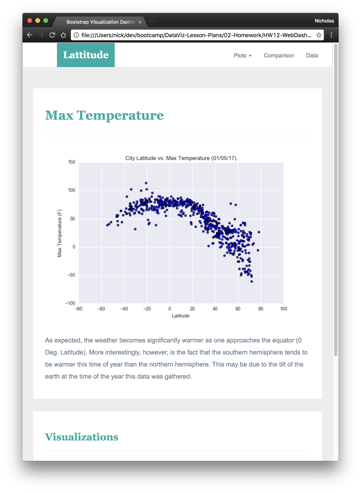

# Web Design

## Latitude - Latitude Analysis Dashboard with Attitude

For this project will be creating a visualization dashboard website using visualizations has been created in other projects. Specifically, will be plotting weather data.

In building this dashboard, will be created an individual page for each plot and a means by which we can navigate between them. 

These pages will contain the visualizations and their corresponding explanations. As example: 

This website include: 

- Landing page: 

 

- Comparisons page:

- Data page:

- Visualization pages:

You can get more information inside the "Code" folder and know how it could be done
